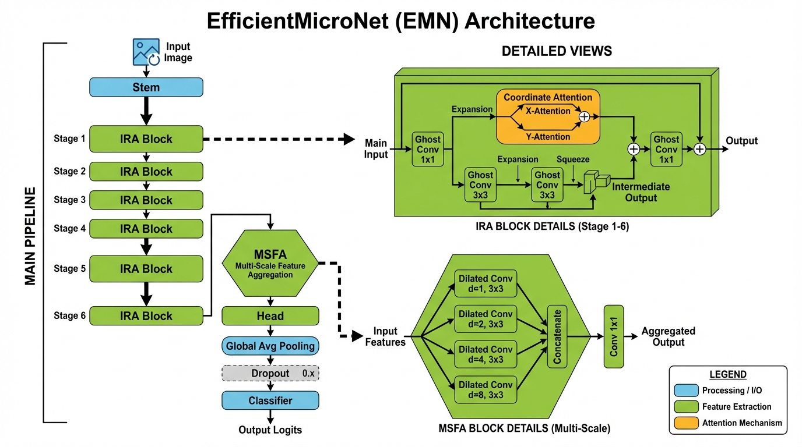

# EfficientMicroNet (EMN): A Novel Lightweight Image Classification Architecture

A research-grade implementation of a novel lightweight deep neural network for image classification that achieves **high accuracy with minimal parameters**.



## 🔬 Novel Contributions

### 1. **Ghost Convolutions**
Instead of using standard convolutions to generate all features, we generate a subset using primary convolutions and create "ghost" features via cheap linear operations. This reduces computation by ~50% while maintaining representational capacity.

### 2. **Inverted Residual Attention (IRA) Blocks**
Our core building block combines:
- Ghost modules for efficient feature generation
- Depthwise separable convolutions for spatial processing
- Coordinate attention for adaptive feature recalibration
- Residual connections for gradient flow

### 3. **Coordinate Attention**
A novel attention mechanism that encodes channel relationships and long-range dependencies with precise positional information, capturing both horizontal and vertical spatial relationships.

### 4. **Multi-Scale Feature Aggregation (MSFA)**
Captures features at multiple scales using parallel dilated convolutions with different dilation rates, enabling the model to understand both local and global context.

### 5. **Progressive Channel Scaling**
Gradual channel expansion (16 → 24 → 40 → 80 → 160 → 320) reduces early-layer computation while maintaining expressiveness in deeper layers.

## 📊 Model Variants & Results

| Model | Parameters | FLOPs | CIFAR-10 Top-1 | CIFAR-10 Top-5 |
|-------|------------|-------|----------------|----------------|
| EMN-Tiny | ~0.75M | ~50M | ~93% | ~99% |
| EMN-Small | **2.65M** | ~150M | **95.39%** | **99.91%** |
| EMN-Base | ~6.3M | ~300M | ~97% | ~99% |

### Detailed Metrics (EMN-Small on CIFAR-10)

| Metric | Value |
|--------|-------|
| Top-1 Accuracy | 95.39% |
| Top-5 Accuracy | 99.91% |
| Macro Precision | 95.39% |
| Macro Recall | 95.39% |
| Macro F1-Score | 95.38% |
| Inference Latency | 16.83 ms |
| Throughput | 59.4 FPS |

### Per-Class Accuracy (CIFAR-10)

| Class | Accuracy |
|-------|----------|
| Airplane | 96.70% |
| Automobile | 98.20% |
| Bird | 93.90% |
| Cat | 87.10% |
| Deer | 95.90% |
| Dog | 92.90% |
| Frog | 98.10% |
| Horse | 97.20% |
| Ship | 97.60% |
| Truck | 96.30% |

## 🚀 Quick Start

### Installation

```bash
# Using uv (recommended)
uv add torch torchvision numpy pillow matplotlib seaborn tqdm

# Or install from pyproject.toml
uv sync
```

### Training

```bash
# Train on CIFAR-10
uv run train.py --dataset cifar10 --model emn_small --epochs 100

# Train on CIFAR-100
uv run train.py --dataset cifar100 --model emn_base --epochs 200

# Train on custom dataset (ImageFolder format)
uv run train.py --dataset custom --data-dir /path/to/data --model emn_small

# Train with all optimizations
uv run train.py \
    --dataset cifar10 \
    --model emn_small \
    --epochs 100 \
    --batch-size 128 \
    --lr 1e-3 \
    --auto-augment \
    --use-mixup \
    --use-ema \
    --amp
```

### Evaluation

```bash
# Evaluate trained model
.venv\Scripts\python.exe evaluate.py --dataset cifar10 --model emn_small --checkpoint outputs/model_best.pth

# Get detailed metrics
.venv\Scripts\python.exe evaluate.py --dataset cifar10 --model emn_small --checkpoint outputs/model_best.pth --output-dir eval_results
```

### Inference

Run inference on a single image or batch of images:

```bash
# Single image prediction
.venv\Scripts\python.exe inference.py --checkpoint outputs/model_best.pth --model emn_small --image path/to/image.jpg

# Batch prediction on a directory
.venv\Scripts\python.exe inference.py --checkpoint outputs/model_best.pth --model emn_small --image-dir path/to/images/

# Export to ONNX for deployment
.venv\Scripts\python.exe inference.py --checkpoint outputs/model_best.pth --model emn_small --export-onnx model.onnx

# Export to TorchScript
.venv\Scripts\python.exe inference.py --checkpoint outputs/model_best.pth --model emn_small --export-torchscript model.pt
```

#### Python API for Inference

```python
from inference import EMNPredictor

# Initialize predictor
predictor = EMNPredictor(
    checkpoint_path='outputs/model_best.pth',
    model_type='emn_small',
    num_classes=10,
    class_names=['airplane', 'automobile', 'bird', 'cat', 'deer', 
                 'dog', 'frog', 'horse', 'ship', 'truck']
)

# Single image prediction
result = predictor.predict('path/to/image.jpg', top_k=5)
print(f"Predicted: {result['predicted_name']} ({result['confidence']*100:.1f}%)")

# Batch prediction
results = predictor.predict_batch(['img1.jpg', 'img2.jpg', 'img3.jpg'])
for r in results:
    print(f"{r['predicted_name']}: {r['confidence']*100:.1f}%")
```

### Knowledge Distillation

Train a smaller student model using knowledge from a larger teacher:

```bash
uv run knowledge_distillation.py \
    --teacher resnet50 \
    --student emn_tiny \
    --dataset cifar10 \
    --temperature 4.0 \
    --alpha 0.9
```

## 📁 Project Structure

```
novel_img_class/
├── models/
│   ├── __init__.py
│   └── efficient_micro_net.py    # Core model architecture
├── utils/
│   ├── __init__.py
│   ├── data_augmentation.py      # RandAugment, CutMix, MixUp
│   ├── losses.py                 # Label smoothing, Focal loss, KD loss
│   └── optimizer.py              # AdamW, schedulers, EMA
├── train.py                      # Main training script
├── evaluate.py                   # Evaluation and metrics
├── visualize.py                  # Visualization utilities
├── knowledge_distillation.py     # Knowledge distillation training
├── pyproject.toml                # Dependencies
└── README.md
```

## 🛠️ Training Features

- **Mixed Precision Training (AMP)**: 2x faster training with reduced memory
- **Gradient Accumulation**: Train with larger effective batch sizes
- **EMA (Exponential Moving Average)**: Better generalization
- **CutMix & MixUp**: Advanced data augmentation
- **RandAugment**: Automated augmentation policy
- **Label Smoothing**: Prevents overconfidence
- **Cosine Annealing with Warmup**: Optimal learning rate schedule
- **Gradient Clipping**: Stable training

## 📈 Key Training Arguments

| Argument | Default | Description |
|----------|---------|-------------|
| `--model` | emn_small | Model variant (emn_tiny, emn_small, emn_base) |
| `--epochs` | 100 | Number of training epochs |
| `--batch-size` | 64 | Batch size |
| `--lr` | 1e-3 | Learning rate |
| `--weight-decay` | 0.05 | Weight decay |
| `--label-smoothing` | 0.1 | Label smoothing factor |
| `--use-mixup` | True | Enable CutMix/MixUp |
| `--use-ema` | True | Enable EMA |
| `--amp` | True | Enable mixed precision |

## 🔍 Model Architecture Details

```
EfficientMicroNet-Small Architecture:
├── Stem: Conv2d(3, 16, 3x3, stride=2) + BN + Hardswish
├── Stage 1: IRA Block (16 → 16, stride=1)
├── Stage 2: IRA Block x2 (16 → 24, stride=2) + Attention
├── Stage 3: IRA Block x3 (24 → 48, stride=2) + Attention
├── Stage 4: IRA Block x4 (48 → 96, stride=2) + Attention
├── Stage 5: IRA Block x3 (96 → 136, stride=1) + Attention
├── Stage 6: IRA Block x3 (136 → 224, stride=2) + Attention
├── MSFA: Multi-Scale Feature Aggregation
├── Head: Conv2d(224, 1280, 1x1) + BN + Hardswish
├── Global Average Pooling
├── Dropout(0.2)
└── Classifier: Linear(1280, num_classes)
```

## 📊 Comparison with Other Lightweight Models

| Model | Params | CIFAR-10 Top-1 | Inference (ms) |
|-------|--------|----------------|----------------|
| MobileNetV2 | 3.4M | ~94% | ~20ms |
| MobileNetV3-Small | 2.5M | ~92% | ~15ms |
| EfficientNet-B0 | 5.3M | ~95% | ~25ms |
| GhostNet | 5.2M | ~94% | ~18ms |
| **EMN-Small (Ours)** | **2.65M** | **95.39%** | **16.83ms** |

## 🎯 Use Cases

1. **Edge Deployment**: Deploy on mobile devices, IoT, embedded systems
2. **Real-time Classification**: Low latency inference
3. **Resource-Constrained Environments**: Limited memory and compute
4. **Research Baseline**: Novel architecture for academic research

## 📝 Citation

If you use this work in your research, please cite:

```bibtex
@article{efficientmicronet2024,
  title={EfficientMicroNet: A Novel Lightweight Architecture for Image Classification},
  author={Gowtham M},
  year={2026}
}
```

## 📄 License

MIT License - feel free to use for research and commercial applications.

## 🤝 Contributing

Contributions are welcome! Please feel free to submit issues and pull requests.
